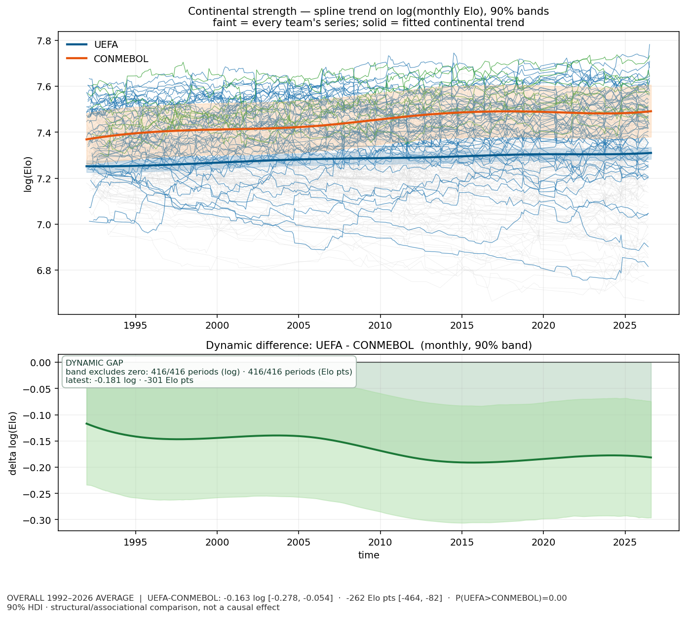
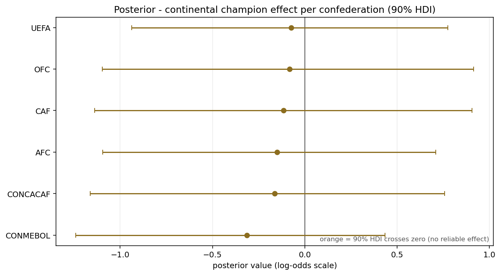
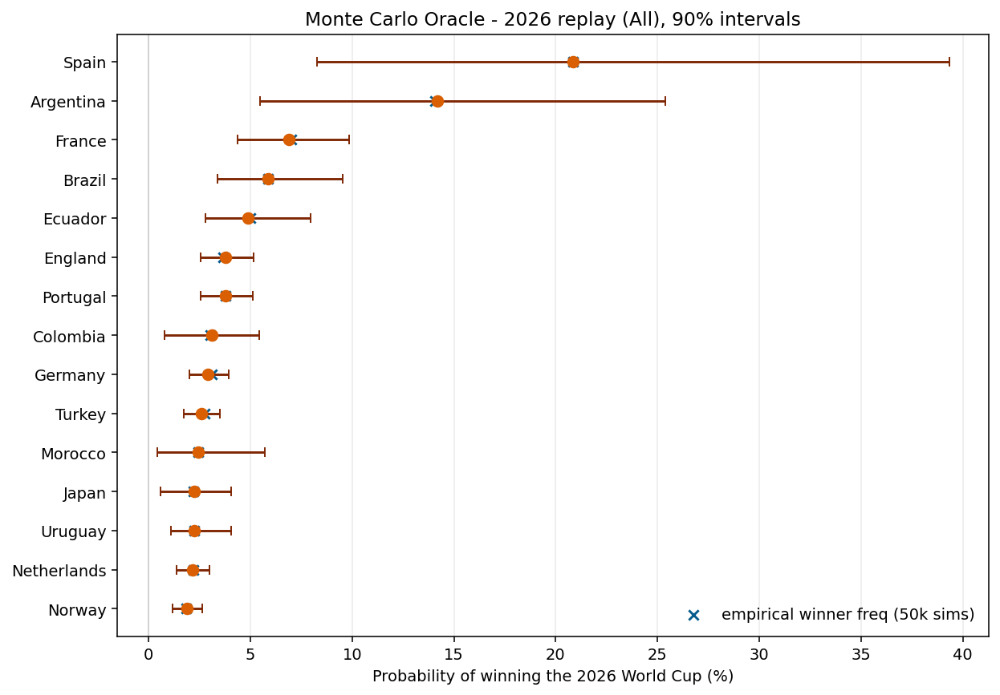
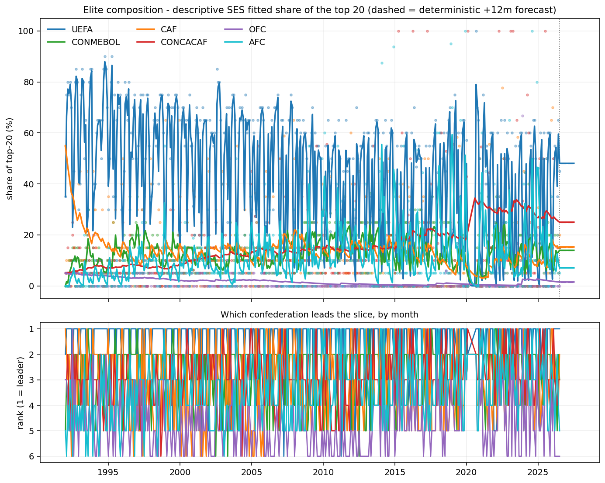

# Soccer Deep Learning - Bayesian World Cup Prediction

[](https://bayesian-world-cup-prediction.onrender.com)
[](https://www.python.org/)
[](https://www.pymc.io/)

An uncertainty-first Bayesian decision-support app for football. It combines hierarchical PyMC
inference, descriptive confederation strength trends, precomputed posterior artifacts, a
50,000-simulation Monte Carlo Oracle, counterfactual `do()` simulations, and an eight-tab Gradio
interface.

The project is called "Soccer Deep Learning," but the modeling core deliberately uses Bayesian
statistical learning rather than a black-box neural network: the dataset contains only 22 World
Cups, so partial pooling and transparent uncertainty are more appropriate than an oversized deep
model.

## Live release

Try the public app: **[bayesian-world-cup-prediction.onrender.com](https://bayesian-world-cup-prediction.onrender.com)**

The Render release serves a self-contained bundle of precomputed artifacts. It loads instantly and
never runs MCMC or model fitting at request time.

## Screenshots

<table>
<tr>
<td width="50%"></td>
<td width="50%"></td>
</tr>
<tr>
<td align="center"><b>Continental strength</b></td>
<td align="center"><b>Posterior forest plot</b></td>
</tr>
<tr>
<td width="50%"></td>
<td width="50%"></td>
</tr>
<tr>
<td align="center"><b>50,000-simulation Monte Carlo Oracle</b></td>
<td align="center"><b>Ranking dynamics</b></td>
</tr>
</table>

## What the app shows

| Tab | Purpose |
|---|---|
| Continental Strength | Hierarchical log-Elo trends, A/B comparison, 90% bands, and differences |
| Forest Plot | Posterior distributions for champion effect, confederation offset, and Elo coefficient |
| Monte Carlo | 50,000 simulated 2026 World Cups with winner probabilities and intervals |
| do()-What-If | Champion-status counterfactual simulation, not a causal estimate |
| Prior Predictive | Comparison of model beliefs before and after the observed data |
| Causal: Continent to Winner | DAG, structural effects, and identification caveat |
| DAG Assumption Tests | Four checks for confounding, independence, sensitivity, and balance |
| Ranking Dynamics | Descriptive top-5/top-10/top-20 composition with SES and a 12-month scenario extension |

## Headline replay

The retrospective 2026 field replay produced these simulation summaries:

- Spain: **20.8%** chance of winning
- Argentina: **14.2%**
- France: **6.9%**
- Brazil: **5.9%**
- Ecuador: **4.9%**
- UEFA: **52.2%** confederation win probability

These are distributions from a model replay, not certainties or claims about the actual match
result.

## Modeling guardrails

- Outputs are distributions with intervals or error bars, never point-only predictions.
- The winner model uses hierarchical pooling across 22 World Cups.
- The latent team-strength path means the continental-champion effect is not causally identifiable.
- `do()` results are counterfactual simulations, not estimated causal effects.
- Ranking Dynamics is deterministic descriptive simple exponential smoothing, not a Bayesian forecast.
- Heavy inference is decoupled from serving; the live app uses static artifacts only.

## Run locally

The serving bundle is self-contained under `spaces/` and reads the static artifacts under
`spaces/data/`.

```powershell
conda run -n causality-handbook python spaces\app.py
```

The app serves on `http://127.0.0.1:7860` by default. To use another port in PowerShell:

```powershell
$env:PORT = "7861"
conda run -n causality-handbook python spaces\app.py
```

## Release validation

Run the no-refit release gate from the Bayesian analysis environment:

```powershell
conda run -n causality-handbook python stages\05_app\validate_release.py --report output\stage05_release_validation.json
```

The gate checks schemas, probability sums, interval ordering, 416 monthly strength periods, 139
quarterly periods, 35 annual periods, 15 pairwise comparisons, all eight tabs, rendered figures,
app parity, and the absence of runtime fitting code.

## Deployment

Render is configured by [`render.yaml`](render.yaml):

- Build: `pip install -r spaces/requirements.txt`
- Start: `python spaces/app.py`
- Health check: `/`
- Binding: `0.0.0.0` on Render's assigned `$PORT`

See [`docs/DEPLOYMENT.md`](docs/DEPLOYMENT.md) for the deployment workflow, failure diagnosis,
verification evidence, and recovery commands. HF Spaces is unavailable for the current account's
free plan because hosted Gradio/Docker Spaces require PRO.

## Project documentation

- [`SESSION_HANDOFF.md`](SESSION_HANDOFF.md) - current stage status, model state, and gotchas
- [`docs/DEPLOYMENT.md`](docs/DEPLOYMENT.md) - live deployment runbook
- [`stages/05_app/README_SPACES.md`](stages/05_app/README_SPACES.md) - serving bundle documentation
- [`spaces/README.md`](spaces/README.md) - published serving-bundle metadata and limitations

## Stage pipeline

| Stage | Output |
|---|---|
| 00 | Data foundation: canon, chronology, and alignment engine |
| 01 | Causal DAG and validation |
| 02 | Priors and prior predictive checks |
| 03 | Hierarchical posterior and GP trend |
| 04 | Monte Carlo Oracle and `do()` contrast |
| 05 | Eight-tab static Gradio release, Render deployment, and public browser verification |

Stages 00-04 and the model-building jobs run on Google Colab VMs driven from the terminal through
the official `colab` CLI in WSL. The public GitHub repository is the source of truth; Colab VMs are
ephemeral. Local execution and security rules remain in the workspace-only guides.

## License

No license has been declared yet. Please open an issue before reusing the code or artifacts in a
redistributed product.
